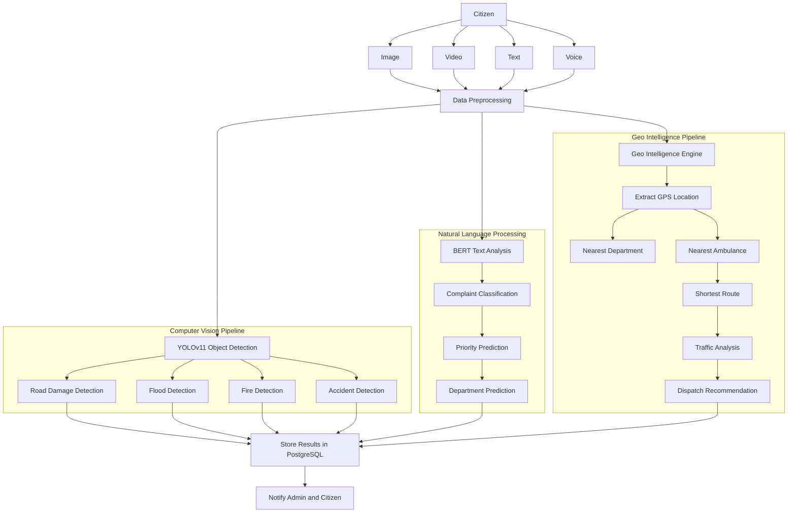

#  AI - Pipeline

```mermaid
flowchart TD

%% Input Layer
Citizen[Citizen]

Image[Image]
Video[Video]
Text[Text]
Voice[Voice]

Citizen --> Image
Citizen --> Video
Citizen --> Text
Citizen --> Voice

%% Preprocessing
Preprocess[Data Preprocessing]

Image --> Preprocess
Video --> Preprocess
Text --> Preprocess
Voice --> Preprocess

%% AI Processing
Preprocess --> CV
Preprocess --> NLP
Preprocess --> GEO

%% Computer Vision
subgraph ComputerVision["Computer Vision Pipeline"]

CV[YOLOv11 Object Detection]

Road[Road Damage Detection]
Flood[Flood Detection]
Fire[Fire Detection]
Accident[Accident Detection]

CV --> Road
CV --> Flood
CV --> Fire
CV --> Accident

end

%% NLP
subgraph NLPPipeline["Natural Language Processing"]

NLP[BERT Text Analysis]

Complaint[Complaint Classification]
Priority[Priority Prediction]
Department[Department Prediction]

NLP --> Complaint
Complaint --> Priority
Priority --> Department

end

%% Geo Intelligence
subgraph GeoPipeline["Geo Intelligence Pipeline"]

GEO[Geo Intelligence Engine]

Location[Extract GPS Location]
NearestDept[Nearest Department]
Ambulance[Nearest Ambulance]
Route[Shortest Route]
Traffic[Traffic Analysis]
Dispatch[Dispatch Recommendation]

GEO --> Location
Location --> NearestDept
Location --> Ambulance
Ambulance --> Route
Route --> Traffic
Traffic --> Dispatch

end

%% Final Output
Store[Store Results in PostgreSQL]
Notify[Notify Admin and Citizen]

Road --> Store
Flood --> Store
Fire --> Store
Accident --> Store

Department --> Store
Dispatch --> Store

Store --> Notify
```
