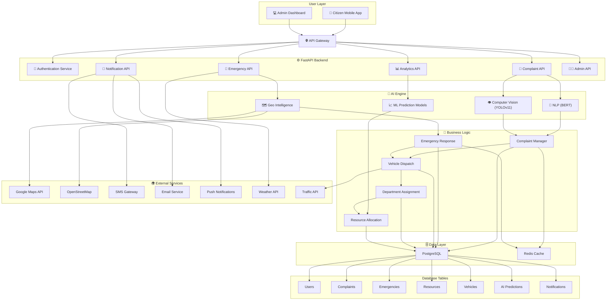

# SmartCity AI - System Architecture

```mermaid
flowchart TB

%% ===========================
%% User Layer
%% ===========================

subgraph Users["User Layer"]
    Citizen["📱 Citizen Mobile App"]
    Admin["💻 Admin Dashboard"]
end

%% ===========================
%% API Layer
%% ===========================

Gateway["🌐 API Gateway"]

Citizen --> Gateway
Admin --> Gateway

%% ===========================
%% Backend Layer
%% ===========================

subgraph Backend["⚙️ FastAPI Backend"]
    Auth["🔐 Authentication Service"]
    ComplaintAPI["📝 Complaint API"]
    EmergencyAPI["🚨 Emergency API"]
    AnalyticsAPI["📊 Analytics API"]
    NotificationAPI["🔔 Notification API"]
    AdminAPI["👨‍💼 Admin API"]
end

Gateway --> Auth
Gateway --> ComplaintAPI
Gateway --> EmergencyAPI
Gateway --> AnalyticsAPI
Gateway --> NotificationAPI
Gateway --> AdminAPI

%% ===========================
%% AI Layer
%% ===========================

subgraph AI["🤖 AI Engine"]
    NLP["🧠 NLP (BERT)"]
    CV["👁️ Computer Vision (YOLOv11)"]
    GeoAI["🗺️ Geo Intelligence"]
    ML["📈 ML Prediction Models"]
end

ComplaintAPI --> NLP
ComplaintAPI --> CV
EmergencyAPI --> GeoAI
AnalyticsAPI --> ML

%% ===========================
%% Business Layer
%% ===========================

subgraph Business["🏢 Business Logic"]
    ComplaintManager["Complaint Manager"]
    EmergencyManager["Emergency Response"]
    Dispatch["Vehicle Dispatch"]
    Department["Department Assignment"]
    Resource["Resource Allocation"]
end

NLP --> ComplaintManager
CV --> ComplaintManager
GeoAI --> EmergencyManager
ML --> Resource

ComplaintManager --> Dispatch
EmergencyManager --> Dispatch
Dispatch --> Department
Department --> Resource

%% ===========================
%% Database Layer
%% ===========================

subgraph Database["🗄️ Data Layer"]
    PostgreSQL["PostgreSQL"]
    Redis["Redis Cache"]
end

ComplaintManager --> PostgreSQL
EmergencyManager --> PostgreSQL
Dispatch --> PostgreSQL
Department --> PostgreSQL
Resource --> PostgreSQL

ComplaintManager --> Redis
EmergencyManager --> Redis

%% ===========================
%% Database Tables
%% ===========================

subgraph Tables["Database Tables"]
    UsersTbl["Users"]
    ComplaintsTbl["Complaints"]
    EmergencyTbl["Emergencies"]
    ResourcesTbl["Resources"]
    VehiclesTbl["Vehicles"]
    AITbl["AI Predictions"]
    NotificationTbl["Notifications"]
end

PostgreSQL --> UsersTbl
PostgreSQL --> ComplaintsTbl
PostgreSQL --> EmergencyTbl
PostgreSQL --> ResourcesTbl
PostgreSQL --> VehiclesTbl
PostgreSQL --> AITbl
PostgreSQL --> NotificationTbl

%% ===========================
%% External Services
%% ===========================

subgraph External["🌍 External Services"]
    Maps["Google Maps API"]
    OSM["OpenStreetMap"]
    SMS["SMS Gateway"]
    Email["Email Service"]
    Push["Push Notifications"]
    Weather["Weather API"]
    Traffic["Traffic API"]
end

GeoAI --> Maps
GeoAI --> OSM
NotificationAPI --> SMS
NotificationAPI --> Email
NotificationAPI --> Push
EmergencyAPI --> Weather
Dispatch --> Traffic
```
