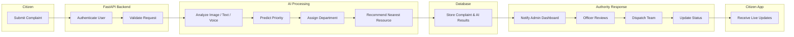

# SmartCity AI - Data Flow

```mermaid
flowchart LR

subgraph User["Citizen"]
    A["Submit Complaint"]
end

subgraph Backend["FastAPI Backend"]
    B["Authenticate User"]
    C["Validate Request"]
end

subgraph AI["AI Processing"]
    D["Analyze Image / Text / Voice"]
    E["Predict Priority"]
    F["Assign Department"]
    G["Recommend Nearest Resource"]
end

subgraph DB["Database"]
    H["Store Complaint & AI Results"]
end

subgraph Authority["Authority Response"]
    I["Notify Admin Dashboard"]
    J["Officer Reviews"]
    K["Dispatch Team"]
    L["Update Status"]
end

subgraph CitizenApp["Citizen App"]
    M["Receive Live Updates"]
end

A --> B
B --> C
C --> D
D --> E
E --> F
F --> G
G --> H
H --> I
I --> J
J --> K
K --> L
L --> M
```
