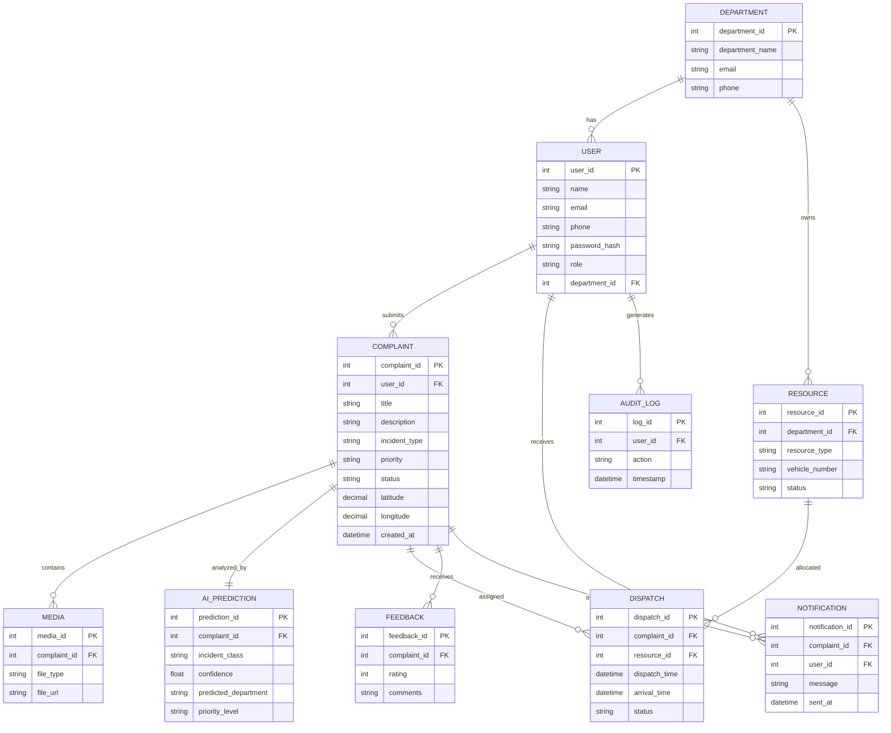

```mermaid
erDiagram

USER ||--o{ COMPLAINT : submits
USER ||--o{ NOTIFICATION : receives
USER ||--o{ AUDIT_LOG : generates

DEPARTMENT ||--o{ USER : has
DEPARTMENT ||--o{ RESOURCE : owns

COMPLAINT ||--o{ MEDIA : contains
COMPLAINT ||--|| AI_PREDICTION : analyzed_by
COMPLAINT ||--o{ DISPATCH : assigned
COMPLAINT ||--o{ FEEDBACK : receives
COMPLAINT ||--o{ NOTIFICATION : triggers

RESOURCE ||--o{ DISPATCH : allocated

USER {
    int user_id PK
    string name
    string email
    string phone
    string password_hash
    string role
    int department_id FK
}

COMPLAINT {
    int complaint_id PK
    int user_id FK
    string title
    string description
    string incident_type
    string priority
    string status
    decimal latitude
    decimal longitude
    datetime created_at
}

MEDIA {
    int media_id PK
    int complaint_id FK
    string file_type
    string file_url
}

AI_PREDICTION {
    int prediction_id PK
    int complaint_id FK
    string incident_class
    float confidence
    string predicted_department
    string priority_level
}

DEPARTMENT {
    int department_id PK
    string department_name
    string email
    string phone
}

RESOURCE {
    int resource_id PK
    int department_id FK
    string resource_type
    string vehicle_number
    string status
}

DISPATCH {
    int dispatch_id PK
    int complaint_id FK
    int resource_id FK
    datetime dispatch_time
    datetime arrival_time
    string status
}

NOTIFICATION {
    int notification_id PK
    int complaint_id FK
    int user_id FK
    string message
    datetime sent_at
}

FEEDBACK {
    int feedback_id PK
    int complaint_id FK
    int rating
    string comments
}

AUDIT_LOG {
    int log_id PK
    int user_id FK
    string action
    datetime timestamp
}
```
